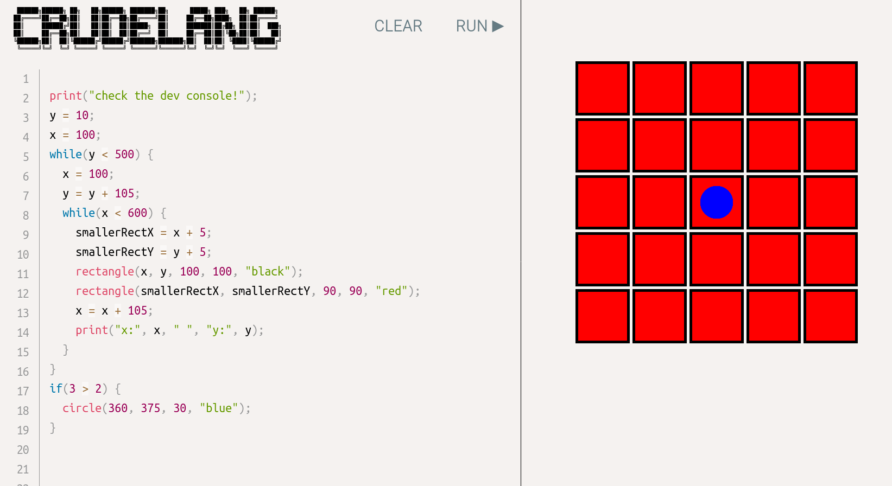

This is a learning project in progress: a small language named crudelang.
I wanted to attempt to make a small language, built upon 'imperative' principles.
You can [try a beta version](https://bergsans.github.io/crudelang/).

At this stage, crudelang is less advanced than a similar project
I've made, [One Page Lisp](https://github.com/bergsans/one-page-lisp). Too me,
it seems easier to make a Lisp-ish language than an imperative language.
I believe this would account for the fact that we so often see tutorials on how to make
a Lisp-language (rather than an imperative). An imperative language (at least
at a minimalistic scale) is messier.

I thought it would be more interesting if you could see some cute output:




## Definition of Done

I have quite a few features on my todo list:

* Boolean values and operators
* Lists
* Local execution environment
* Better error handeling
* More Comparision operators
* More graphics (line, dot, ...)
* Fix ALL bugs :)
* And so on...

## Setup

```
npm install
npm start
```
